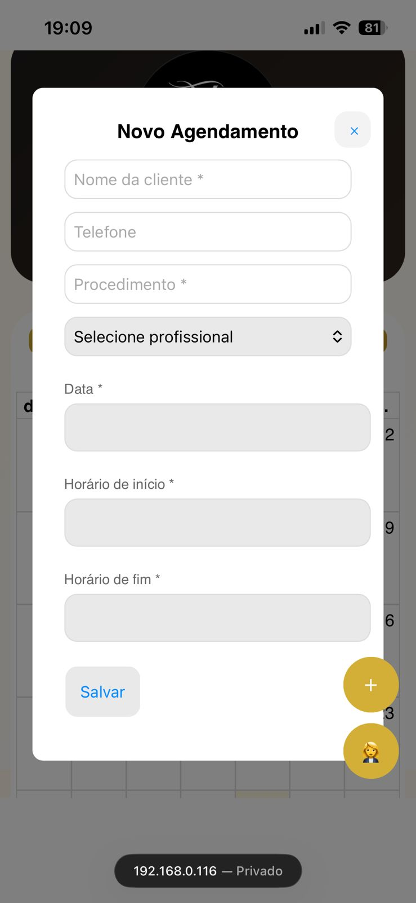
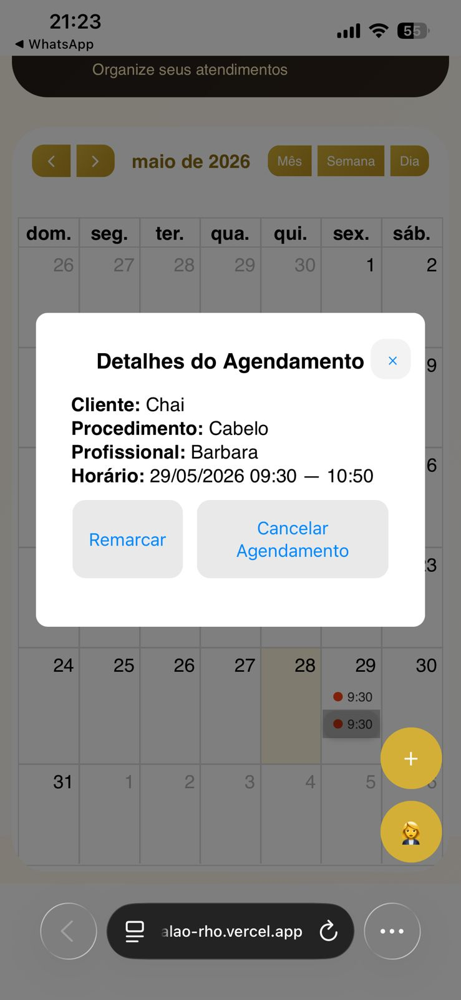
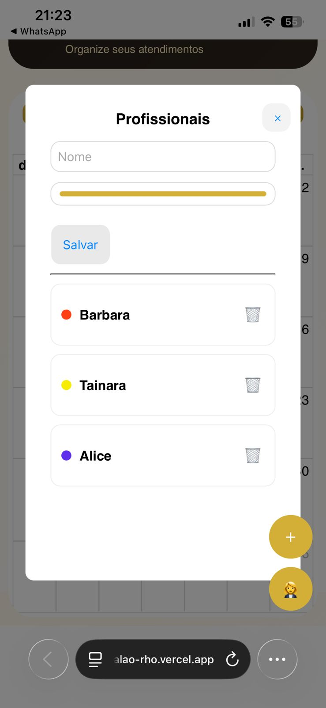
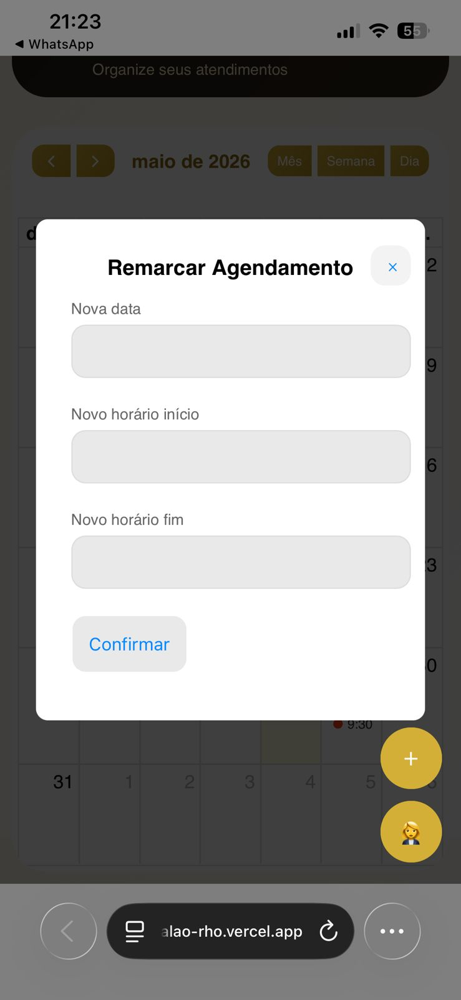
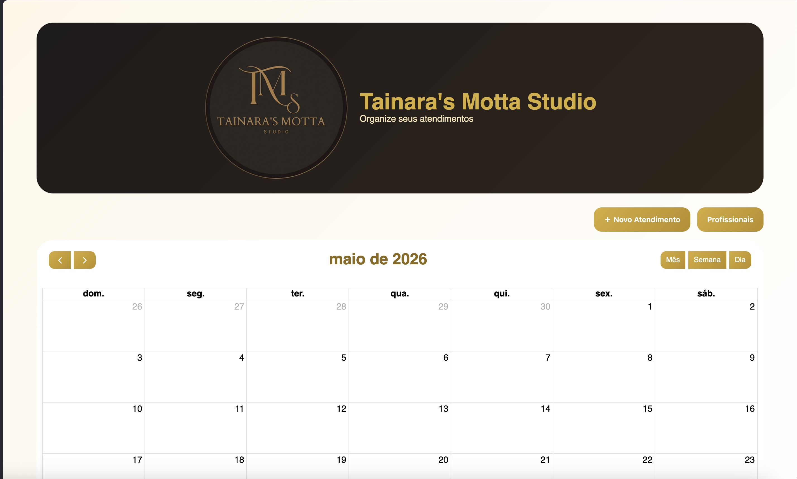
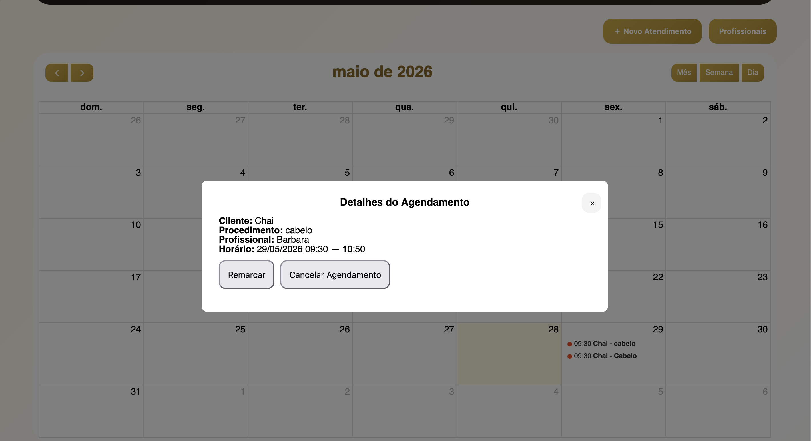

💇 Sistema de agendamento para Salão de Beleza

Sistema web para gerenciamento de agenda de um salão de beleza, com visualização em calendário, controle de profissionais e integração com banco de dados.
Desenvolvido com foco em organização, eficiência e experiência do usuário para gestão de salão de beleza.

Funcionalidades:

- Cadastro de agendamentos com horário de início e fim
- Visualização em calendário (FullCalendar)
- Bloqueio de horários por profissional
- Cadastro de profissional
- Edição, remarcação e cancelamento de agendamentos
- Cores diferentes por profissional
- Painel lateral com detalhes do agendamento
- Interface responsiva (desktop e mobile)
- Integração com Supabase (banco de dados)

Tecnologias utilizadas

- HTML5
- CSS3
- JavaScript
- FullCalendar
- Supabase
- Git / GitHub

Estrutura do projeto: 
├── 📁 Frontend
│   ├── index.html
│   ├── style.css
│   ├── app.js
│   ├── supabase.js
│   └── assets/ (logo, imagens, ícones)
│
└── README.md

Status do projeto:

 Em desenvolvimento ativo
 Estrutura principal funcionando
 Ajustes finais em andamento
 Projeto publicado via Vercel.

 Melhorias futuras:
 
 1.Notificações automáticas de agendamento
 2.Integração com WhatsApp

## Prints do sistema

### Novo agendamento

  

---

### Detalhes do agendamento

  

---

### Profissionais

  

---

### Remarcar atendimento

  

---

## Responsivo a todas as telas

### Tela inicial Desktop

  

---

### Tela de detalhes Desktop

  

